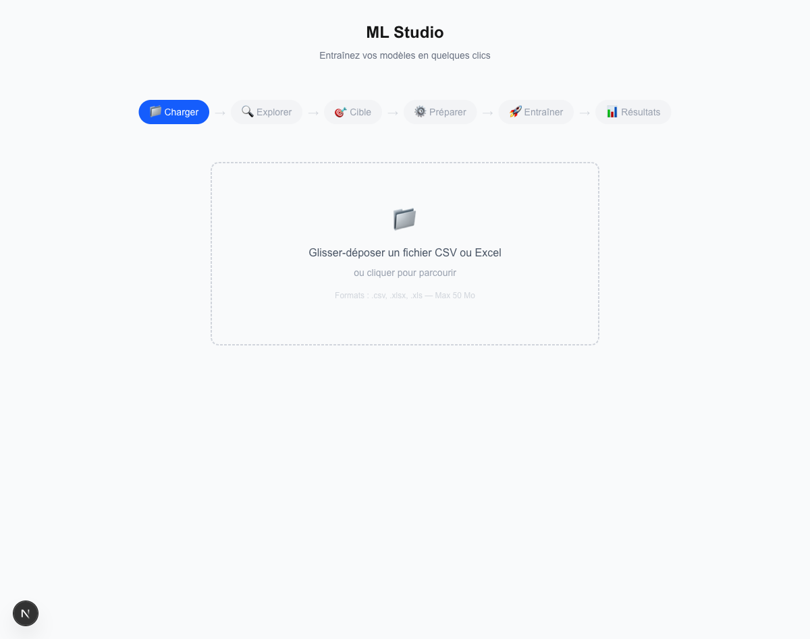
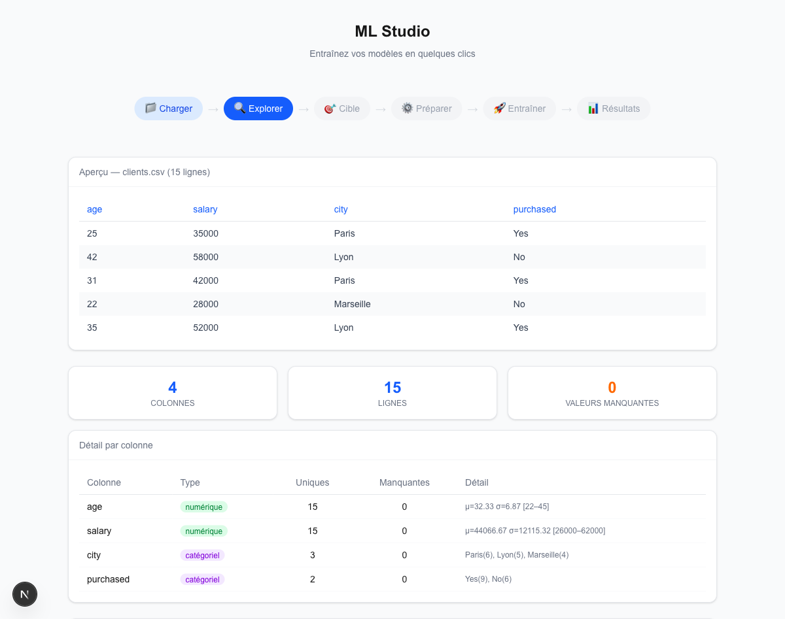
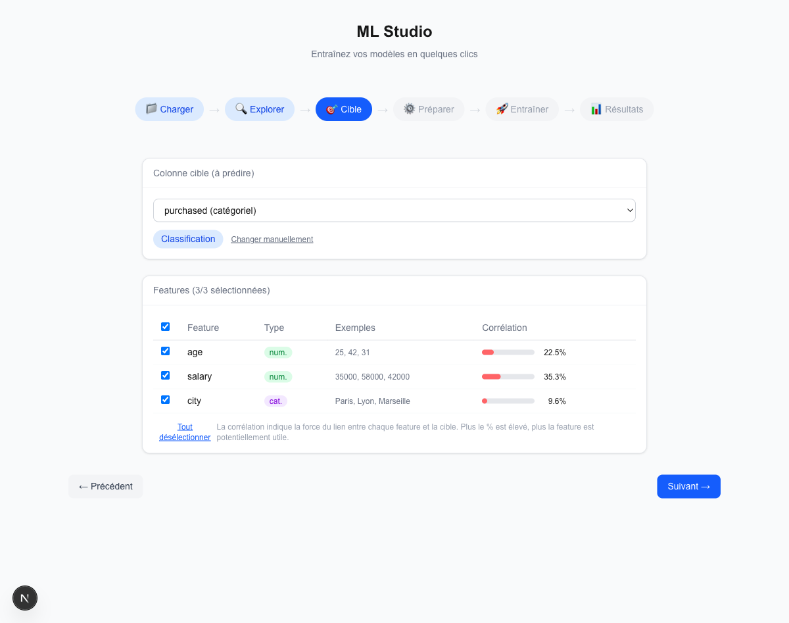
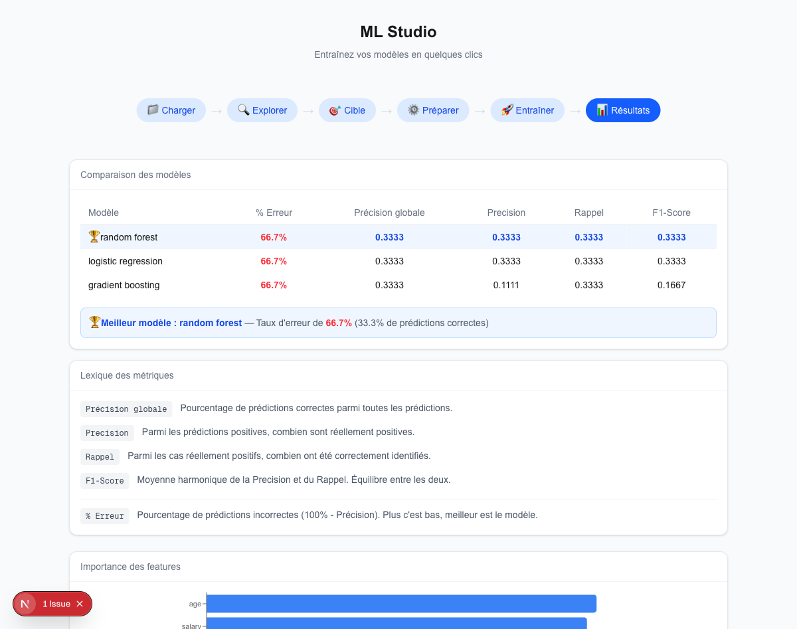
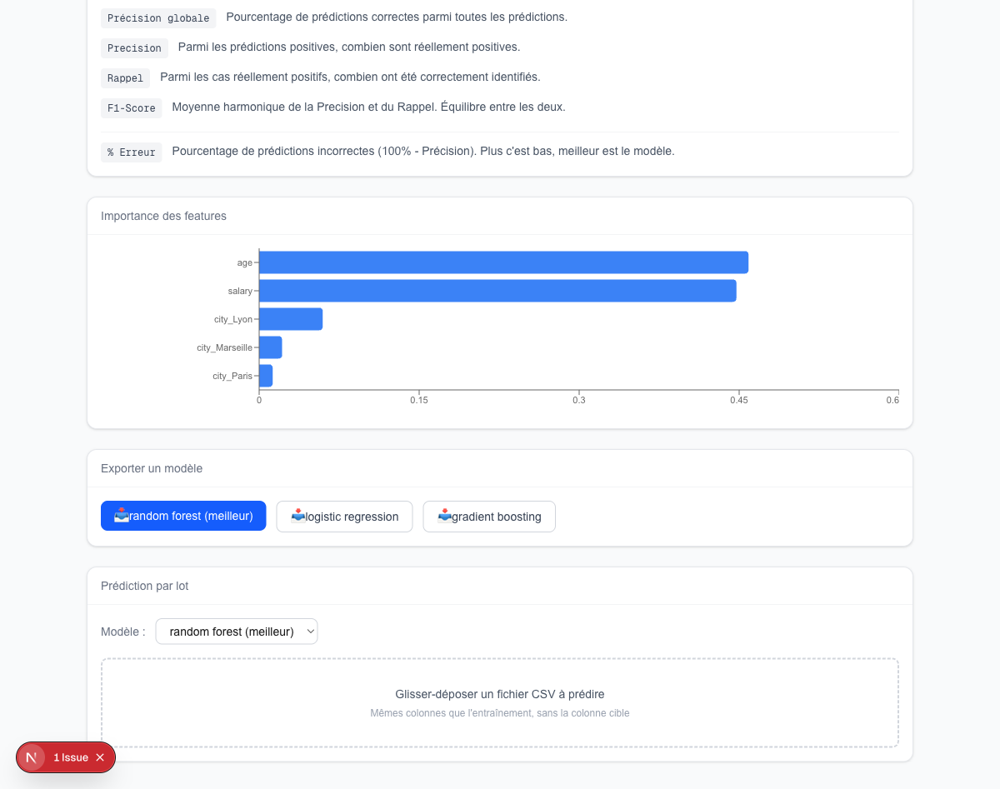

# ML Studio

Plateforme no-code d'entraînement de modèles de Machine Learning. Uploadez un CSV, explorez vos données, entraînez des modèles et obtenez des prédictions — le tout depuis une interface web intuitive.

## Screenshots

### 1. Upload de données

Glisser-déposer un fichier CSV ou Excel pour commencer.



### 2. Exploration des données

Aperçu du dataset, statistiques par colonne, détection automatique des types (numérique/catégoriel).



### 3. Sélection des features

Choix de la colonne cible et des features. Détection automatique du type de tâche (classification/régression). Barres de corrélation pour guider la sélection.



### 4. Résultats et comparaison

Tableau comparatif des modèles avec métriques (accuracy, precision, recall, F1-score), meilleur modèle mis en avant, importance des features, export des modèles.



### 5. Prédiction par lot et export

Upload d'un nouveau CSV pour obtenir des prédictions. Sélection du modèle, tableau des résultats avec colonne prédiction surlignée, téléchargement CSV.



## Stack technique

| Couche | Technologies |
|--------|-------------|
| Frontend | Next.js 16, React 19, TypeScript, Tailwind CSS, Recharts |
| Backend | FastAPI, Python, scikit-learn, pandas |
| Communication | REST API, WebSocket (progression en temps réel) |

## Fonctionnalités

- Upload CSV/Excel (max 50 Mo)
- Exploration : aperçu, statistiques, distributions, corrélations
- Descriptions de colonnes par IA (Claude Haiku)
- Preprocessing configurable : gestion des valeurs manquantes, scaling, encoding
- 4 algorithmes de classification : Random Forest, Logistic Regression, SVM, Gradient Boosting
- 4 algorithmes de régression : Random Forest, Linear Regression, SVR, Gradient Boosting
- Hyperparameter tuning avec GridSearchCV
- Progression en temps réel via WebSocket
- Matrice de confusion (classification) et graphiques actual vs predicted (régression)
- Feature importance
- Export des modèles (.joblib)
- Prédiction par lot : upload CSV, prédictions instantanées, téléchargement CSV

## Installation

### Backend

```bash
cd backend
python3 -m venv venv
source venv/bin/activate
pip install -r requirements.txt
uvicorn main:app --reload --port 8000
```

### Frontend

```bash
cd frontend
npm install
npm run dev
```

L'application est accessible sur http://localhost:3000/studio.

## Tests

```bash
cd backend
source venv/bin/activate
python -m pytest tests/ -v
```

## Licence

MIT
